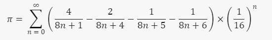
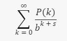

# Pi Calculator

# 🟢Program Overview
This program provides a multi-threaded method to calculate the value of pi with high accuracy. This is done using Java's ExecutorService and AtomicReference, which are used to manage threads and keep the result of computations thread-safe, respectively. Also, this program uses the BigDecimal class in Java to perform high precision calculations.
# 🟢Number 𝜋
Pi (𝜋) is a mathematical constant. This constant is defined as the ratio of the circumference of a circle to its diameter and has different equivalent definitions. This number appears in many mathematical formulas, in all fields of mathematics and physics. The oldest use of the Greek letter
𝜋 to show the ratio of a circle's circumference to its diameter, was introduced by a Welsh mathematician named William Jones in 1706. This constant is approximately equal to 3.14159 and sometimes it is also called Archimedes constant.
# 🟢Bailey–Borwein–Plouffe formula
The Bailey–Borwein–Plouffe (BBP) formula is a formula for calculating the number π, discovered by Simon Plouffe in 1995. The formula is named after the three authors of the paper in which it was published, David H. Bailey, Peter Borwein, and Simon Plouffe.
The BBP formula is as follows:

This formula is a digit extraction algorithm for π in base 16. This means that the formula allows the nth digit of π in base 16 to be calculated without needing to calculate the previous digits. Since its discovery, similar formulas have been investigated in other bases. This class of formulas is now known as BBP-type formulas.

The existence of this formula was considered a surprise. Before its discovery, it was believed that calculating the nth digit of π was as hard as calculating the first n digits of π. Since then, formulas with the general form below have been discovered for many other irrational numbers:

Where P and Q are polynomials with integer coefficients and b is an integer base. Formulas with this form are known as BBP-type formulas.

# Semaphore

# 🟢Program Overview
This program demonstrates how to use a Semaphore to control access to a resource. At most two Operator threads can access the resource at the same time. If more than two threads try to access the resource, they will have to wait until one of the threads currently accessing the resource releases the semaphore.
# 🟢Controller
This is the main class that starts the application. It creates a Semaphore with two permits, meaning that at most two threads can acquire the semaphore at the same time. It then creates five Operator threads, each of which is given the semaphore. The threads are then started, which causes their run method to be called.
# 🟢Operator
This class extends Thread, meaning it represents a thread of execution in the program. Each Operator is given a name and a Semaphore when it is created. In its run method, it first tries to acquire the semaphore. If successful (which means that less than two threads are currently holding the semaphore), it prints a message and then accesses a resource ten times, sleeping for a short period between each access. After it has finished accessing the resource, it prints another message and releases the semaphore, allowing other threads to acquire it.
# 🟢Resource
This class represents the resource that the Operator threads are trying to access. The accessResource method simply causes the thread that calls it to sleep for a short period, simulating the time it takes to access the resource.